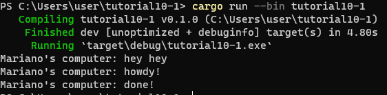
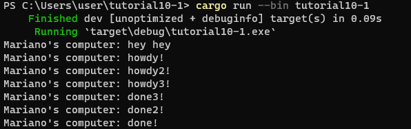

Yang terjadi adalah string "... hey hey" keluar pertama dan langsung diikuti string "... howdy!", kemudian 2 detik setelahnya baru string "... done!" keluar. string "... hey hey" keluar pertama karena perintah printnya sebelum perintah executor.run, yang kemudian langsung string "... howdy!" juga keluar, dan 2 detik setelah itu baru string "... done!" keluar karena ada fungsi TimerFuture yang di set untuk menunggu 2 detik.

Semua string "... howdy!" keluar terlebih dahulu, baru 2 detik setelah itu keluar semua string "... done!". Perbedaan saat ada perintah drop(spawner) dan tidak adalah saat perintah tersebut ada maka program akan berhenti setelah semua print dalam spawn berhasil dijalankan, ,namun saat perintah tersebut tidak ada maka program tidak akan berhenti.